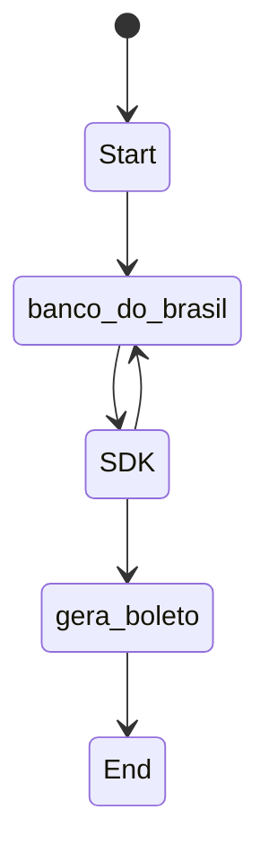

<h1 align="center">SDK para boletos do Banco do Brasil</h1>
<h3 align="center">Gere boletos de forma mais fácil com esse SDK, controlando sempre<br> o último boleto gerado de forma simples.</h3>
<p align="center">
        <a href="https://github.com/filipeas/boleto-banco-brasil/releases/tag/0.0.7" alt="Version">
            
        </a>
</p>


## Funcionalidades disponíveis
1) Buscar o último boleto gerado.
2) Gerar novo boleto a partir do último gerado.

## Funcionalidades pendentes
1) Adicionar pagamento por PIX.

## Configuração
1) Baixe o pacote com ``` npm i boleto-banco-brasil ```.
2) No seu projeto faça o import do pacote usando ``` const {Client} = require('boleto-banco-brasil'); ```.

## Como usar
Instancie a classe Client:
```
const bbClient = new Client({
  BB_API_KEY: '0000000000111111111133333333335555555555',
  BB_BASIC_CREDENTIALS: 'Basic key',
  BB_CONVENIO: '1234567',
  BB_WALLET: '00',
  BB_WALLET_VARIATION: '11',
  BB_AGENCIA: '222',
  BB_CONTA: '987654',
  ENVIRONMENT: 'dev'
});
```

Tenha atenção em colocar corretamente suas credênciais da sua conta do Banco do Brasil.

Observe o parâmetro ``` ENVIRONMENT ```. Ele serve para você informar se quer usar o sandbox da API do Banco do Brasil ou o ambiente de produção. Use ``` dev ``` para sandbox e ``` prod ``` para produção.

Para fazer uma busca do último boleto gerado use ``` bbClient.SearchLastPurchase().then(response => console.log(response)); ```.

E para criar um boleto a partir do último gerado, use 
```
bbClient.CreatePurchase({
  customerAddress: 'Mocambinho',
  customerCity: 'Teresina',
  customerCPF: '96050176876',
  customerName: 'Filipe A. Sampaio',
  customerNeighborhood: 'Avenida Santa joana Darq',
  customerStateCode: 'PI',
  customerZipCode: '77458000',
  purchaseValue: '1200'
}).then(response => console.log(response));
```

## Observações gerais
1) Os boletos em PDF são salvos na pasta ``` tmp/uploads/boletos/ ``` na raíz do seu projeto.
2) Tenha em mente em usar configurações de teste da sua conta do Banco do Brasil, para evitar usar os números reais da API.
4) Durante seus testes em algum momento talvez a criação do boleto falhe devido ao número do boleto gerado já está em uso. Mas não se preocupe, isso é normal pois a API do Banco do Brasil é compartilhada com todos os Devs da API. logo, por exemplo, se você gerou um número de boleto 1 não necessáriamente o seu próximo número será 2. Assim, adicionamos uma flag de controle de ambiente de desenvolvimento chamada ``` environment ```, onde se você estiver executando em ambiente de desenvolvimento, você deve colocar a flag ``` dev ``` e em ambiente de produção você deve colocar a flag ``` prod ```. A flag ``` dev ``` criará números de boleto aleatório, já a ``` prod ``` procurará o último boleto da sua conta.
5) Criamos um controle de último boleto gerado quando você tentar criar um boleto novo. Funciona da seguinte forma: quando você tentar criar um boleto novo, antes o SDK irá procurar o último boleto gerado, pesquisando os últimos 3 dias da API do Banco do Brasil. Se ele não achar boletos nesse intervalo, o SDK fará uma nova pesquisa para os 3 dias anteriores ao intervalo anterior, e fará isso até achar uma lista de boletos.

## Fluxograma do SDK


## Diagramas do funcionamento


## Modelo do PDF do boleto gerado
Abaixo mostramos o modelo que o SDK gera do boleto:


## O que esse SDK propõe?
- Gerar boletos válidos do Banco do Brasil. Mas como?
    - O SDK irá requisitar sempre a API do Banco do Brasil usando suas credênciais para achar o último boleto gerado válido. Ele irá procurar por um range que você pode configurar, porém o padrão será de até 3 dias. Após essa listagem, será pego o último boleto e seu número será incrementado para o novo boleto válido.
- Gerar PDF do modelo do boleto usado pelo Banco do Brasil.

## Testes Unitários
Ainda não há testes unitários na versão refatorada. Pretendemos adicionar.

## Melhorias pendentes
- [ ] [BUG] caso a conta seja nova e nunca foi gerado um boleto, a criação do boleto falhará, pois ele tentará achar o último boleto gerado infinitamente
- [ ] Adicionar método de pagamento por PIX.