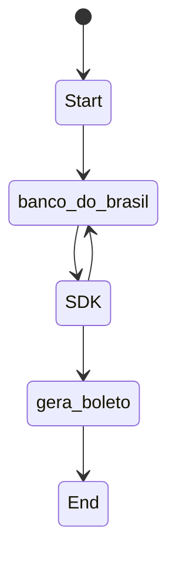

<h1 align="center">SDK para boletos do Banco do Brasil</h1>
<h3 align="center">Gere boletos de forma mais fácil com esse SDK, controlando sempre<br> o último boleto gerado de forma simples.</h3>
<p align="center">
        <a href="https://github.com/filipeas/boleto-banco-brasil/releases/tag/0.1.0" alt="Version">
        </a>
</p>

## Configuração
1) Baixe o projeto.
2) Instale as dependências com ``` yarn ``` ou ``` npm i ```.
3) Crie um arquivo ``` .env ``` e use o conteúdo do arquivo ``` .env-example ``` e cole dentro de ``` .env ```. Preencha as variáveis com suas informações da sua conta do Banco do Brasil.
4) Caso esteja em ambiente de desenvolvimento, no arquivo ``` .env ``` use a flag ``` BB_ENVIRONMENT = 'dev' ```. Caso esteja em ambiente de produção, use ``` BB_ENVIRONMENT = 'prod' ```.

## Observações gerais
1) Os boletos em PDF são salvos na pasta ``` tmp/uploads/boletos/ ```.
2) A execução de testes funcionais não cria boletos. Só é possível testar a criação do boleto buildando o projeto e executando a função diretamente [(Olhar seção: Como fazer um teste rápido das funcionaidades do SDK)](https://github.com/filipeas/boleto-banco-brasil#como-fazer-um-teste-r%C3%A1pido-das-funcionaidades-do-sdk).
3) Tenha em mente em usar configurações de teste da sua conta do Banco do Brasil, para evitar usar os números reais da API.
4) Durante seus testes em algum momento talvez a criação do boleto falhe devido ao número do boleto gerado já está em uso. Mas não se preocupe, isso é normal pois a API do Banco do Brasil é compartilhada com todos os Devs da API, logo se você gerou um número de boleto 1 não necessáriamente o seu próximo número será 2. Assim, adicionamos uma flag de controle de ambiente de desenvolvimento no arquivo ``` .env-example ``` chamada ``` BB_ENVIRONMENT = 'dev' # dev (development) or prod (production) ```, onde se você estiver executando em ambiente de desenvolvimento, você deve colocar a flag ``` dev ``` e em ambiente de produção você deve colocar a flag ``` prod ```.
5) Criamos um controle de último boleto gerado quando você tentar criar um boleto novo. Funciona da seguinte forma: quando você tentar criar um boleto novo, antes o SDK irá procurar o último boleto gerado, pesquisando os últimos 3 dias da API do Banco do Brasil. Se ele não achar boletos nesse intervalo, o SDK fará uma nova pesquisa para os 3 dias anteriores ao intervalo anterior, e fará isso até achar uma lista de boletos.

## Fluxograma do SDK


## Diagramas do funcionamento


## O que esse SDK propõe?
- Gerar boletos válidos do Banco do Brasil. Mas como?
    - O SDK irá requisitar sempre a API do Banco do Brasil usando suas credênciais para achar o último boleto gerado válido. Ele irá procurar por um range que você pode configurar, porém o padrão será de até 3 dias. Após essa listagem, será pego o último boleto e seu número será incrementado para o novo boleto válido.
- Gerar PDF do modelo do boleto usado pelo Banco do Brasil.

## Como executar os testes funcionais
Foi implementado testes funcionais no projeto. São eles:
- FindlastBoleto
- CreateBoleto

Ambos fazem requisição para a API do banco do brasil para funcionar. Para executá-los você deve:

1) Instalar as dependências do projeto com ``` yarn ``` ou ``` npm i ```.
2) Configurar arquivo .env com as suas variáveis de conexão com a API do banco do brasil.
3) Executar ``` yarn test ``` ou ``` node test ```.

## Como fazer um teste rápido das funcionaidades do SDK
Para verificar a execução do SDK, execute:
1) Instale as dependências do projeto (passos anteriores).
2) Execute ``` yarn build ``` para buildar o projeto para javascript.
3) Execute ``` node dist/test/create-boleto.js ``` para criar um boleto de teste.
4) Execute ``` node dist/test/find-last-boleto.js ``` para visualizar o último boleto.

## Melhorias pendentes
    [ ] remover .env do projeto e fazer o usuario passar informacoes por parametro
    [ ] remover testes funcionais, pois eles so funcionam se for colocado a autenticacao no .env
    [ ] implementar testes unitários